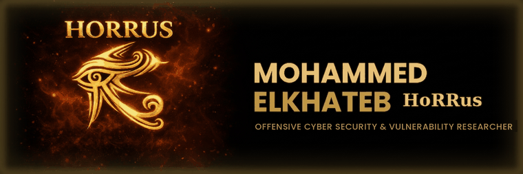

<!-- ============ ANIMATED LOGO BANNER ============ -->
<p align="center">
  
</p>

<!-- ============ ANIMATED SKILLS TAGLINE ============ -->
<p align="center">
  
</p>

<!-- ============ WHOAMI ============ -->
```console
horrus@offsec:~$ whoami --full

  Name        : Mohammed ElKhateb  (محمد الخطيب)
  Alias       : HoRRus
  Role        : Vulnerability Researcher · Red Team Operator
  Focus       : Adversary emulation · AD attack chains · Web exploitation
  Frameworks  : MITRE ATT&CK · PTES
  HTB Rank    : Omniscient · Grandmaster ◆◆◆  (Lvl 117 · Season 11 #39)
  Credit      : CVE-2025-63607  (discovered, reported & registered)
  Status      : Breaking things in authorized environments, then documenting the fix.
```

<!-- ============ FEATURED / PROOF ============ -->
## 🎯 Featured &amp; Proof of Work

- 📺 **TV Interview** — discussing modern offensive security · [watch](https://youtu.be/AZ-OnICWgjQ)
- 🎧 **Podcast** — deep dive on red teaming · [listen](https://youtu.be/ql9d2SPP3AQ)
- 🛡️ **CVE-2025-63607** — discovered &amp; responsibly disclosed · [advisory](https://github.com/7Horrus/security-research/tree/main/CVE-2025-63607)
- ✍️ **Write-ups** — red-team walkthroughs &amp; attack chains · [Medium](https://medium.com/@HoRRus)
- 🧩 **Hack The Box** — Omniscient · Grandmaster · [profile](https://app.hackthebox.com/users/1506676)

<!-- ============ ARSENAL ============ -->
## 🧰 Arsenal

<p align="left">
  
  
  
  
  
  
  <br>
  
  
  
  
  
  <br>
  
  
  
</p>

<!-- ============ CONNECT ============ -->
## 🌐 Connect

<sub>Every profile below is anchored to one machine-readable registry:
<a href="https://horrus-offsec.com/identity.json"><code>horrus-offsec.com/identity.json</code></a></sub>

<p align="left">
  <a href="https://horrus-offsec.com/"></a>
  <a href="https://www.linkedin.com/in/mohammed-elkhateb-horrus"></a>
  <a href="https://x.com/HoRRusElKhateb"></a>
  <a href="https://www.instagram.com/horrus_official/"></a>
  <a href="https://www.facebook.com/Mohammed.ElKhateb.HoRRus/"></a>
</p>

<sub>⚔️ All research is conducted in authorized, controlled environments and disclosed responsibly.</sub>
